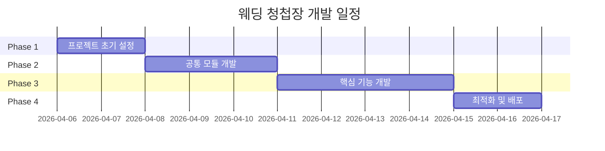

# Wedding Web - 개발 로드맵

> **목표**: Notion을 CMS로 활용한 모바일 최적화 웨딩 청첩장 웹 페이지 개발
> **총 예상 기간**: 7–11일

---

## 전체 일정

---

## Phase 1: 프로젝트 초기 설정

**예상 소요**: 1–2일
**목적**: 견고한 개발 기반 구축. 환경 설정이 불완전하면 이후 모든 기능 개발이 막히므로 가장 먼저 처리한다.

### 작업 목록

- [ ] `@notionhq/client` 패키지 설치
- [ ] `.env` 파일 생성 및 환경변수 설정
  - `VITE_NOTION_API_KEY`
  - `VITE_NOTION_WEDDING_PAGE_ID`
  - `VITE_NOTION_BUFFET_DB_ID`
- [ ] `src/App.tsx`에 `WeddingPage` 라우팅 추가
  - `Page` 타입에 `'wedding'` 추가
  - Header 네비게이션 버튼 추가
  - 조건부 렌더링 추가
- [ ] `src/pages/WeddingPage.tsx` 기본 골격 생성 (5개 섹션 자리 표시)
- [ ] Vercel 프로젝트 초기화 및 환경변수 등록
- [ ] `.env.example` 파일 생성 (팀 공유용)

### 완료 기준

- `npm run dev` 실행 후 WeddingPage로 네비게이션 동작
- 콘솔에서 Notion API 키 환경변수 로드 확인
- Vercel CLI로 로컬 환경 연결 (`vercel dev`)

---

## Phase 2: 공통 모듈 개발

**예상 소요**: 2–3일
**목적**: 5개 섹션 컴포넌트 모두에서 재사용되는 코드를 먼저 작성해 중복을 방지하고 일관된 데이터 구조를 확보한다.

### 작업 목록

**TypeScript 타입 정의** (`src/types/wedding.ts`)
- [ ] `WeddingInfo` — 신랑·신부 정보, 날짜, 장소, 소개글
- [ ] `ContactInfo` — 이름, 전화번호
- [ ] `GalleryImage` — URL, alt 텍스트
- [ ] `BuffetItem` — 메뉴명, 카테고리, 설명, 순서

**Notion API 함수** (`src/lib/notion.ts`)
- [ ] `fetchWeddingInfo()` — 결혼식 정보 단일 페이지 조회
- [ ] `fetchBuffetMenu()` — 뷔폐 메뉴 데이터베이스 조회
- [ ] API 오류 시 fallback 처리 (빈 데이터 반환)

**커스텀 훅** (`src/hooks/useWeddingData.ts`)
- [ ] loading / error / data 상태 관리
- [ ] `fetchWeddingInfo`, `fetchBuffetMenu` 병렬 호출

**공통 컴포넌트**
- [ ] `SectionWrapper` — 섹션 공통 레이아웃 래퍼 (padding, max-width)

### 완료 기준

- `useWeddingData` 훅이 실제 Notion 데이터를 반환
- loading / error / success 세 가지 상태 모두 처리
- `npm run build` TypeScript strict 모드 빌드 오류 없음

---

## Phase 3: 핵심 기능 개발

**예상 소요**: 3–4일
**목적**: 웨딩 청첩장의 핵심 콘텐츠인 5개 섹션을 순서대로 구현한다.

### 작업 목록

**섹션 컴포넌트** (`src/components/sections/`)

- [ ] **HeroSection.tsx** — 청첩장 메인
  - 신랑·신부 이름 표시
  - 결혼식 날짜·시간·장소
  - 배경 이미지 레이아웃

- [ ] **IntroSection.tsx** — 소개글
  - Notion 페이지 본문 렌더링
  - 줄바꿈·단락 처리

- [ ] **ContactSection.tsx** — 신랑·신부 연락처
  - 이름, 전화번호 표시
  - `tel:` 링크로 전화 앱 연결
  - 터치 버튼 최소 44px 보장

- [ ] **GallerySection.tsx** — 웨딩 사진 갤러리
  - 모바일(~767px): 스와이프 캐러셀
  - 데스크탑(768px~): 그리드 레이아웃
  - 이미지 alt 텍스트 추가

- [ ] **BuffetSection.tsx** — 뷔폐 메뉴
  - 카테고리별 그룹핑 (한식 / 양식 / 일식 / 디저트 / 음료)
  - 메뉴명, 설명 표시
  - 카드 또는 리스트 형태

**WeddingPage 조합** (`src/pages/WeddingPage.tsx`)
- [ ] 5개 섹션 컴포넌트 조합
- [ ] `useWeddingData` 훅 연결
- [ ] 로딩 스켈레톤 UI 추가

### 완료 기준

- 5개 섹션 모두 모바일(375px)에서 레이아웃 깨짐 없이 표시
- 각 섹션에 Notion 실제 데이터 반영
- `tel:` 링크 탭 시 전화 앱 실행 확인
- 갤러리 모바일/데스크탑 레이아웃 전환 동작

---

## Phase 4: 최적화 및 배포

**예상 소요**: 1–2일
**목적**: 완성된 기능의 품질을 높이고 실제 서비스 환경에 배포한다.

### 작업 목록

**성능 최적화**
- [ ] 갤러리 이미지 `loading="lazy"` 적용
- [ ] Notion API 응답 캐싱 전략 적용 (SWR `revalidateOnFocus: false` 또는 `staleWhileRevalidate`)
- [ ] 불필요한 리렌더링 점검

**접근성 및 UI 검토**
- [ ] 모든 이미지 alt 텍스트 확인
- [ ] 터치 타겟 44px 이상 확인
- [ ] 반응형 브레이크포인트 최종 점검 (375px / 768px / 1280px)

**보안 검토**
- [ ] 클라이언트 번들에 Notion API 키 미노출 확인
- [ ] `.env` 파일 `.gitignore` 등록 확인

**배포**
- [ ] `npm run build` 최종 빌드 통과
- [ ] Vercel 배포 (`vercel --prod`)
- [ ] 도메인 연결 (선택)

### 완료 기준

- Vercel 배포 URL에서 전체 기능 정상 동작
- 3G 환경 기준 LCP 3초 이내 (Lighthouse 측정)
- Notion API 키가 DevTools Network 탭에 미노출
- TypeScript strict 모드 빌드 오류 0개

---

## 완료 정의 (DoD)

프로젝트 전체 완료를 선언하려면 아래 항목을 모두 충족해야 한다.

- [ ] 5개 섹션이 모바일(375px)에서 정상 표시
- [ ] Notion 데이터 변경 시 웹 페이지에 자동 반영
- [ ] Notion API 키가 클라이언트 코드에 노출되지 않음
- [ ] Vercel 배포 성공 및 도메인 접근 가능
- [ ] `npm run build` TypeScript strict 모드 오류 없음
